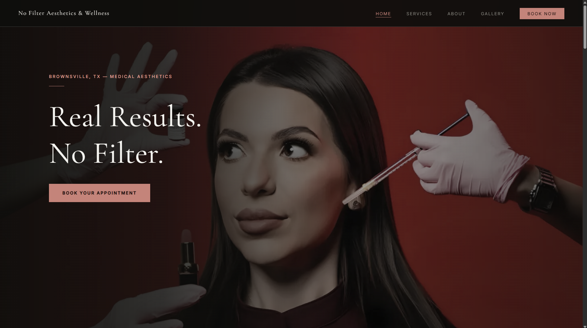

# No Filter Aesthetics & Wellness

A professional, multi-page website for a medical aesthetics and wellness practice in Brownsville, TX.

> Built as a freelance project. Source code is shared for portfolio purposes — client images are excluded.

---

## Demo


[](https://youtu.be/16IWKhFvCTU)


---

## Pages

| Page | File |
|------|------|
| Homepage | `index.html` |
| Services | `services.html` |
| About | `about.html` |
| Gallery | `gallery.html` |
| Contact / Book | `contact.html` |

---

## Tech Stack

- HTML5 / CSS3 / Vanilla JavaScript
- Google Fonts — Cormorant Garamond + Inter
- Deployed on Netlify

---

## Features

- Multi-page layout with shared navigation
- Fixed nav bar with blur/frosted glass effect
- Hamburger menu — mobile responsive
- Scroll-triggered fade-in animations
- Gallery with category filter (All, Botox, Filler, etc.)
- Two location addresses (current + coming soon)
- Google Maps link

---

## Project Structure

```
no-filter-aesthetics/
├── index.html
├── services.html
├── about.html
├── gallery.html
├── contact.html
└── css/
    └── style.css
```

---

## Phase 2 — Training Academy (Planned)

A course platform for Botox & filler training courses, planned for later in 2025. Nav link is already stubbed in — will link to a subdomain when ready.
